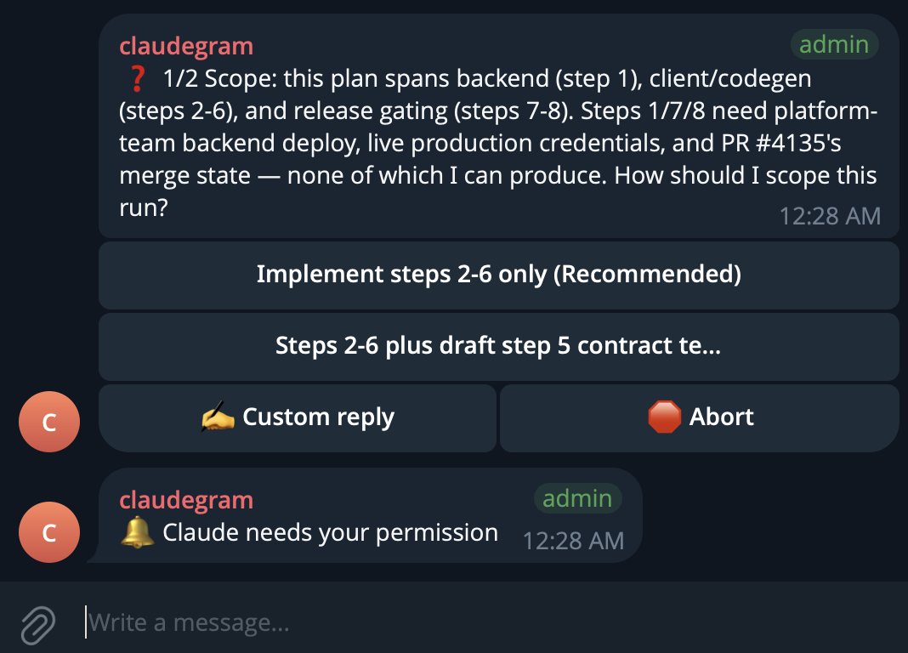

# claudegram

claudegram connects Claude Code sessions to Telegram forum topics. From Telegram, you can read replies, answer questions, approve tools, send prompts, and stop a running turn.

This is a personal project, not affiliated with Anthropic or Telegram.

<p align="center">
  
</p>

## How it works

Claude Code hooks send session events to a daemon on the same machine. The daemon creates one Telegram topic for each session, then posts assistant replies, tool summaries, notifications, and compaction notices to that topic.

Messages travel in both directions. Telegram text goes to the matching tmux pane. A message containing `stop` sends Ctrl+C. Permission requests and questions use inline buttons, so they can be resolved without returning to the terminal.

claudegram does not call a hosted relay. Each machine runs its own daemon and talks to Telegram's Bot API.

Multiple hosts can use separate bots in the same forum supergroup. Each daemon handles only the sessions running on its machine.

Claude Code must run inside tmux for Telegram input and `stop` to work. Outbound notifications still work without tmux.

## Getting started

### Requirements

- macOS or Linux
- tmux
- Claude Code
- a Telegram account
- Node.js 25.2.1
- pnpm 10.26.2
- Bun 1.3.5

### Build from source

```sh
git clone https://github.com/jkomyno/claudegram.git
cd claudegram
pnpm install --frozen-lockfile
pnpm build
```

The build writes the native executable to `packages/cli/build/claudegram`. `claudegram` is the main command, and `cgm` is its short alias.

Link both commands into `~/.local/bin`, which must already be on `PATH`:

```sh
mkdir -p "$HOME/.local/bin"
ln -s "$PWD/packages/cli/build/claudegram" "$HOME/.local/bin/claudegram"
ln -s "$PWD/packages/cli/build/claudegram" "$HOME/.local/bin/cgm"
```

### Configure Telegram

Run the setup wizard:

```sh
claudegram setup
```

The wizard configures Telegram, Claude Code hooks, and the daemon:

1. Create a bot with BotFather and enter its token privately.
2. Disable the bot's group privacy mode.
3. Create or prepare a supergroup with topics and grant the required bot permissions.
4. Send a one-time command that discovers the group and authorizes your Telegram account.
5. Choose whether the wizard starts the daemon.

The wizard verifies that the bot can post before it writes the config and installs global Claude Code hooks.

The bot token is stored in the config file with user-only permissions. Environment variables can expose the token to child processes and process inspection tools.

Check the finished setup:

```sh
claudegram doctor
```

## Commands

```text
claudegram setup [--no-input]
claudegram start
claudegram stop
claudegram restart
claudegram status [--json]
claudegram logs [--lines N]
claudegram doctor [--json]
claudegram hooks install|uninstall|status [--scope global|project] [--project PATH]
claudegram service install|uninstall|status
claudegram version
```

`claudegram hook` and `claudegram daemon` are internal entrypoints. The installed Claude Code handlers call `hook`. The background process calls `daemon`.

Project-scoped hooks go into `.claude/settings.local.json`. Global hooks go into `~/.claude/settings.json`. Install and uninstall preserve unrelated settings and handlers.

## Configuration

The default config path is `~/.config/claudegram/config.json`. Set `CLAUDEGRAM_CONFIG` to use another path.

```json
{
  "botToken": "123456:replace-me",
  "chatId": -1001234567890,
  "ownerUserId": 123456789,
  "socketPath": "/Users/you/.local/state/claudegram/daemon.sock",
  "topicTtlHours": 72,
  "verbose": false
}
```

Environment variables override file values. File values override defaults.

| Environment variable | Purpose |
| --- | --- |
| `CLAUDEGRAM_BOT_TOKEN` | Telegram bot token |
| `CLAUDEGRAM_CHAT_ID` | Forum supergroup id |
| `CLAUDEGRAM_OWNER_USER_ID` | Telegram user allowed to control Claude |
| `CLAUDEGRAM_SOCKET_PATH` | Unix socket path |
| `CLAUDEGRAM_TOPIC_TTL_HOURS` | Inactive topic lifetime |
| `CLAUDEGRAM_VERBOSE` | Verbose logging |
| `CLAUDEGRAM_CONFIG` | Config file path |

`XDG_CONFIG_HOME` and `XDG_STATE_HOME` change the default config and state roots.

## Start on login

Install a per-user launchd service on macOS or systemd user service on Linux:

```sh
claudegram service install
```

Remove the service with:

```sh
claudegram service uninstall
```

The service restarts after failures and starts when the user session starts. It does not install a system-wide daemon.

## Troubleshooting

Run `claudegram doctor` first. It checks the token, chat id, daemon socket, tmux, and global hooks.

If the daemon process exists but the socket is unavailable, inspect `claudegram logs` and then run `claudegram restart`.

Telegram transport failures redact the bot token from `claudegram logs`. If a token appears anywhere else, revoke it with BotFather and run `claudegram setup` again.

If outbound messages work but Telegram input does not, start Claude Code inside tmux and verify that `$TMUX_PANE` exists in the Claude Code shell.

If hooks do not fire, run `claudegram hooks status`. You can also open `/hooks` inside Claude Code and inspect the configured source.

## Development

```sh
pnpm build
pnpm test
pnpm typecheck
pnpm lint:ci
pnpm check:exports
```

The tmux end-to-end test is opt-in:

```sh
CLAUDEGRAM_TMUX_E2E=1 pnpm test:integration
```

Tests use a local fake Telegram Bot API. They do not send real Telegram messages.
